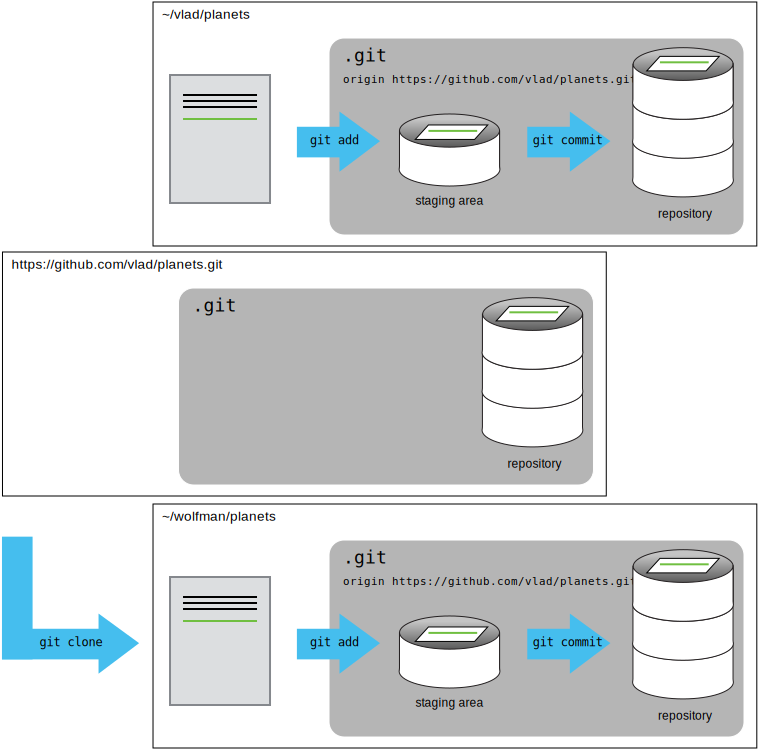

Now most of you are going to be working on <b>Setonix/Magnus/Topaz - confirm</b>,
but from time to time you may want to develop scripts or work on your projects on
your local machine. Here, we're going to see how you can use version control to 
set up a multi-machine workflow to efficiently transfer your work between your own
machine and Pawsey systems.

Some of the steps here should be revision from previous lessons, so try to do as much
as you can without looking at the answers!

First, you'll need to ssh into <b>Setonix - confirm</b> and change into your scratch
directory, as this is where we want to put `planets`.

~~~
$ ssh username@setonix.pawsey.org.au
$ cd $MYSCRATCH
~~~
{: .language-bash}

Next you'll need to go through the process of setting up a public-private pair
again like we did on your local machine, and copying it to your [GitHub account](https://github.com/settings/keys) 
(don't forget to note down the passphrase you choose at the prompt!):

## Hint
> Remember once you have set it up, you can find the public key to copy over here:
> ~~~
> $ cat ~/.ssh/id_ed25519.pub
> ~~~
> {: .language-bash}
> 
> 
> And you can check that the connection is successful like so:
> ~~~
> $ ssh -T git@github.com
> ~~~
> {: .language-bash}
>
> ~~~
> Hi usernameXXXX! You've successfully authenticated, but GitHub does not provide shell access.
> 
> ~~~
> {: .output}
{: .solution}

## Solution
To create a key on <b>Zeus/magnus/setonix</b> you would use the command:
> ~~~
> $ ssh-keygen -t ed25519 -C "github-account-email@gmail.com"
> ~~~
> {: .language-bash}
{: .solution}


Then, we'll make a copy of the entire remote repository on <b>Setonix</b>
using a process called "cloning a repo". `git clone` (don't forge to change 
username to your own!):

~~~
$ git clone git@github.com:username/planets.git
$ git checkout -b main
~~~ 
{: .language-bash}


Now we're ready to make some changes to the repository, let's add a new file:

~~~
$ touch pawsey_planets.txt
$ git add pawsey_planets.txt
$ git commit -m "created pawsey_planets.txt"
~~~
{: .language-bash}

Then push our changes back to the remote repository.

~~~
$ git push origin main
~~~
{: .language-bash}

~~~ 
Enumerating objects: 3, done.
Counting objects: 100% (3/3), done.
Delta compression using up to 32 threads
Compressing objects: 100% (2/2), done.
Writing objects: 100% (2/2), 229 bytes | 229.00 KiB/s, done.
Total 2 (delta 1), reused 0 (delta 0), pack-reused 0
remote: Resolving deltas: 100% (1/1), completed with 1 local object.
To github.com:username/planets.git
   6c8fdc4..f55eca8  main -> main
~~~
{: .output}

Note that we didn't have to create a remote called `origin`: Git uses this
name by default when we clone a repository.  (This is why `origin` was a
sensible choice earlier when we were setting up remotes by hand.)

Take a look at the repository on GitHub again, and you should be 
able to see the new commit. You may need to refresh
your browser to see the new commit.

Now, either logout of <b>Setonix - check</b> (remember you can just type `logout`), or open a new
terminal window and navigate to the `planets` directory on your local machine. Enter the `ls` command
and inspect the output. Do you see `pawsey_planets.txt`? If not, why? and what do you need to do to fix 
it?

## Solution
> No, you won't see `pawsey_planets.txt` yet because we haven't updated the repo on our local machine!
> To fix this we need to pull from the remote repository again:
> ~~~
> $ git pull origin main
> ~~~
> {: .language-bash}
> After doing this you should see `pawsey_planets.txt` in your remote repository with the `ls` command.
{: .solution}

And that's all there is to it! You have your `planets` directory on both your local machine and 
<b>Setonix - confirm </b> linked via the remote repository on GitHub, and you can easily transfer
your code/files/results between the two.

> ## GitHub and large data files
>
> Note that GitHub is not designed to handle large files out of the box, so make sure to 
> add any data folders to your `.gitignore` before staging any commits. If you do need some way to 
> transfer large `.md5` files or the like, check out our later lesson on [Open Science](https://pawsey-internships.github.io/version-control/10-open/index.html).
{: .callout}

Now that's half the story, what if you want to share your work with your supervisor, or another
intern, so they can make some additions to your code? This is going to work much the same 
way as it does above for two machines, just this time one of the machines has another 
human at the keyboard! 

For the next step, get into pairs.  One person will be the "Owner" and the other
will be the "Collaborator". The goal is that the Collaborator add changes into
the Owner's repository. We will switch roles at the end, so both persons will
play Owner and Collaborator. Now is a good time to remind your instructor 
about setting Collaborator-Owner pairs if s/he has forgotten.
Hint: pairs.png


The Owner needs to give the Collaborator access. On GitHub, click the settings
button on the right, select Manage access, click Invite a collaborator, and
then enter your partner's username.


To accept access to the Owner's repo, the Collaborator
needs to go to [https://github.com/notifications](https://github.com/notifications).
Once there she can accept access to the Owner's repo.

Next, the Collaborator needs to clone the Owner's repo, just like we did above.
However this time, we want to make sure we can tell the difference between our own
`planets` folder and our collaborator's. To do this, we supply the target directory
as a second argument to `git clone`:

~~~
$ git clone git@github.com:username/planets.git ~/Desktop/partner-planets
~~~
{: .language-bash}

If you choose to clone without the clone path
(`~/Desktop/partner-planets`) specified at the end,
you will clone inside your own planets folder!
Make sure to navigate to the `Desktop` folder first.



The Collaborator can now make a change in her clone of the Owner's repository,
exactly the same way as we've been doing before. Try something out! You'll need 
to make some changes, <i>stage</i> those changes with `git add`, commit them with
`git commit` (don't forget to add a commit message) and finally <i>push</i> the 
commit.

## Solution
> Your process might look something like this:
> 
> ~~~
> $ cd ~/Desktop/vlad-planets
> $ nano pluto.txt
> $ cat pluto.txt
> ~~~
> {: .language-bash}
>
> ~~~
> It is so a planet!
> ~~~
> {: .output}
>
> ~~~
> $ git add pluto.txt
> $ git commit -m "Add notes about Pluto"
> ~~~
> {: .language-bash}
> 
> ~~~
>  1 file changed, 1 insertion(+)
>  create mode 100644 pluto.txt
> ~~~
> {: .output}
{: .solution}


Then push the change to the *Owner's repository* on GitHub:

~~~
$ git push origin main
~~~
{: .language-bash}

~~~
Enumerating objects: 4, done.
Counting objects: 4, done.
Delta compression using up to 4 threads.
Compressing objects: 100% (2/2), done.
Writing objects: 100% (3/3), 306 bytes, done.
Total 3 (delta 0), reused 0 (delta 0)
To https://github.com/vlad/planets.git
   9272da5..29aba7c  main -> main
~~~
{: .output}

Check your own repo on GitHub to prove to yourself that you haven't made any changes 
there. 

> ## Some more about remotes
>
> In this episode and the previous one, our local repository has had
> a single "remote", called `origin`. A remote is a copy of the repository
> that is hosted somewhere else, that we can push to and pull from, and 
> there's no reason that you have to work with only one. For example, 
> on some large projects you might have your own copy in your own GitHub
> account (you'd probably call this `origin`) and also the main "upstream"
> project repository (let's call this `upstream` for the sake of examples).
> You would pull from `upstream` from time to 
> time to get the latest updates that other people have committed.
>
> Remember that the name you give to a remote only exists locally. It's
> an alias that you choose - whether `origin`, or `upstream`, or `fred` -
> and not something intrinstic to the remote repository.
>
> The `git remote` family of commands is used to set up and alter the remotes
> associated with a repository. Here are some of the most useful ones:
>
> * `git remote -v` lists all the remotes that are configured (we already used
> this in the last episode)
> * `git remote add [name] [url]` is used to add a new remote
> * `git remote remove [name]` removes a remote. Note that it doesn't affect the 
> remote repository at all - it just removes the link to it from the local repo.
> * `git remote set-url [name] [newurl]` changes the URL that is associated 
> with the remote. This is useful if it has moved, e.g. to a different GitHub
> account, or from GitHub to a different hosting service. Or, if we made a typo when
> adding it!
> * `git remote rename [oldname] [newname]` changes the local alias by which a remote 
> is known - its name. For example, one could use this to change `upstream` to `fred`.
{: .callout}

To download the Collaborator's changes from GitHub, the Owner now enters:

~~~
$ git pull origin main
~~~
{: .language-bash}

~~~
remote: Enumerating objects: 4, done.
remote: Counting objects: 100% (4/4), done.
remote: Compressing objects: 100% (2/2), done.
remote: Total 3 (delta 0), reused 3 (delta 0), pack-reused 0
Unpacking objects: 100% (3/3), done.
From https://github.com/vlad/planets
 * branch            main     -> FETCH_HEAD
   9272da5..29aba7c  main     -> origin/main
Updating 9272da5..29aba7c
Fast-forward
 pluto.txt | 1 +
 1 file changed, 1 insertion(+)
 create mode 100644 pluto.txt
~~~
{: .output}

Now the three repositories (Owner's local, Collaborator's local, and Owner's on
GitHub) are back in sync. 

> ## Switch Roles and Repeat
>
> Once you're satisfied, switch roles with your partner so 
> that you become the Owner and vice versa.
{: .challenge}

> ## A Basic Collaborative Workflow
>
> In practice, it is good to be sure that you have an updated version of the
> repository you are collaborating on, so you should `git pull` before making
> our changes. This is true whether you are "collaborating with yourself" across
> multiple machines, or with your supervisor or another intern.
> The basic collaborative workflow would be:
>
> * update your local repo with `git pull origin main`,
> * make your changes and stage them with `git add`,
> * commit your changes with `git commit -m`, and
> * upload the changes to GitHub with `git push origin main`
>
> It is better to make many commits with smaller changes rather than
> of one commit with massive changes: small commits are easier to
> read and review.
{: .callout}


> ## Review Changes
>
> The Owner pushed commits to the repository without giving any information
> to the Collaborator. How can the Collaborator find out what has changed with
> command line? And on GitHub?
>
> > ## Solution
> > On the command line, the Collaborator can use ```git fetch origin main```
> > to get the remote changes into the local repository, but without merging
> > them. Then by running ```git diff main origin/main``` the Collaborator
> > will see the changes output in the terminal.
> >
> > On GitHub, the Collaborator can go to the repository and click on 
> > "commits" to view the most recent commits pushed to the repository.
> {: .solution}
{: .challenge}

> ## Comment Changes in GitHub
>
> The Collaborator has some questions about one line change made by the Owner and
> has some suggestions to propose.
>
> With GitHub, it is possible to comment the diff of a commit. Over the line of
> code to comment, a blue comment icon appears to open a comment window.
>
> The Collaborator posts its comments and suggestions using GitHub interface.
{: .challenge}

> ## Version History, Backup, and Version Control
>
> Some backup software can keep a history of the versions of your files. They also
> allows you to recover specific versions. How is this functionality different from version control?
> What are some of the benefits of using version control, Git and GitHub?
{: .challenge}

> ## Six Effective Git Commands to Own Your Workflow 
>
> Great way to work with multiple branches:
> * `git stash` stash your local changes
> * `git pull origin main` Update the branch with the most recent code.
> * `git stash apply` Merge your local changes with the most recent code.
> * `git add .` Add your changes.
> * `git commit -m "Informative and memorable short message"` Commit your changes.
> * `git push origin main` Push your changes.
{: .callout}

