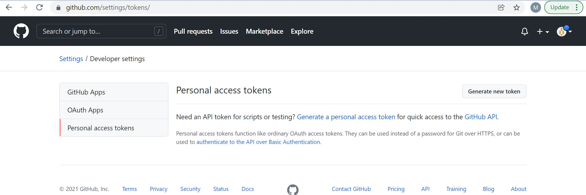
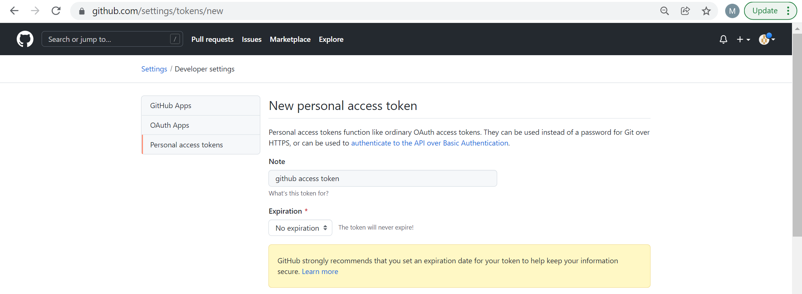
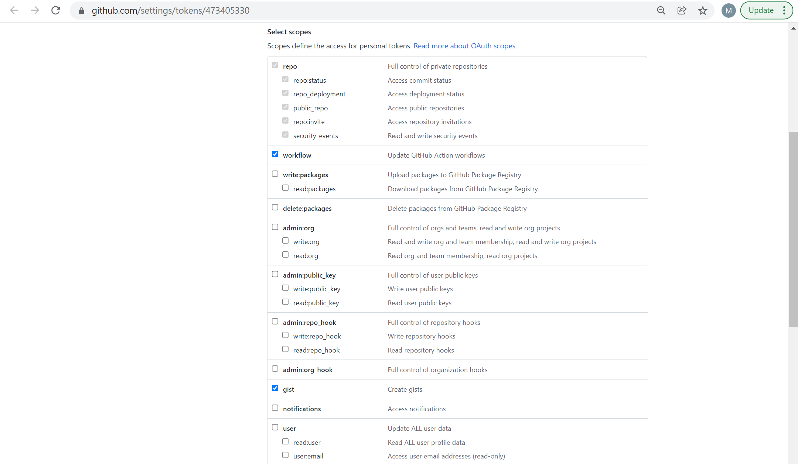
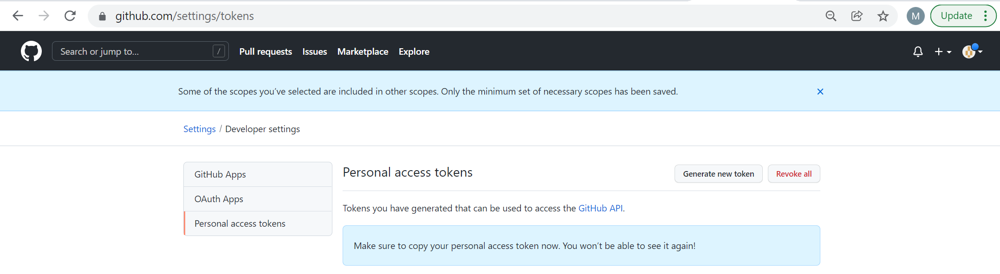
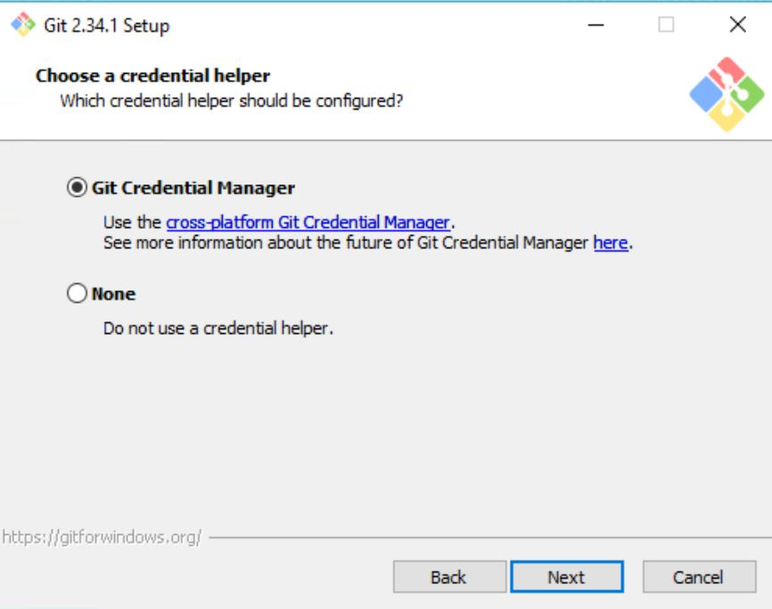
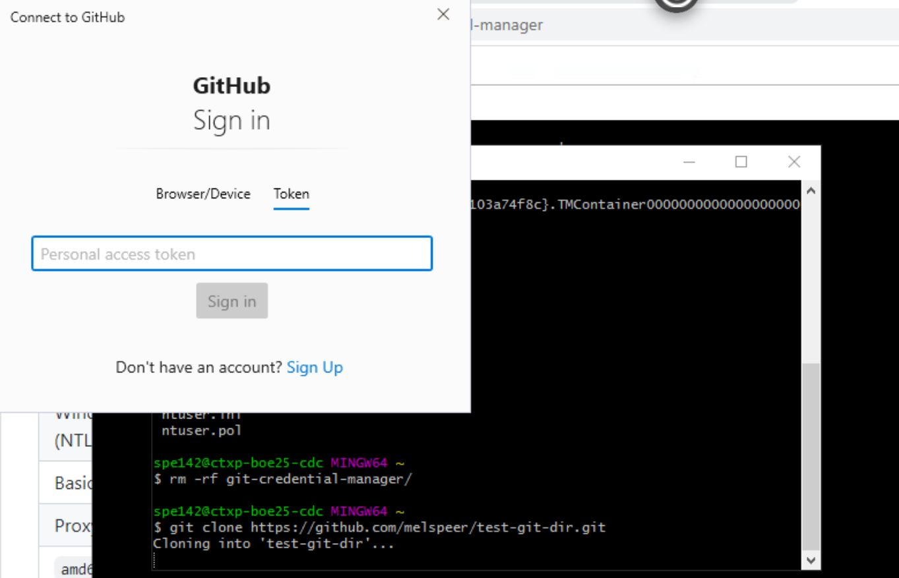
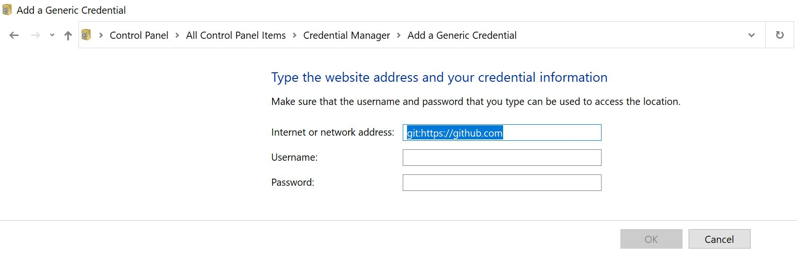

# Create a Personal Access Token (PAT) for your GitHub Account

Since 31/08/2021,  Git cannot clone a private GitHub repository or push to a GitHub repository using only a GitHub user name and password. In place of your password, you are required to use a Personal Access Token (PAT) that is created by the GitHub account that owns the remote repository or a GitHub account that has been invited to the repository as a collaborator.

You can create a PAT for GitHub in your account settings. If you are logged into a GitHub account, [this link](https://github.com/settings/tokens/) will take you to your PAT management page, Otherwise:

1. Navigate to https://github.com and log into your GitHub account.
2. In the top-right of the browser window, click on your user icon to open a drop-down menu and select 'Settings. 
3. From the 'Public Profile Page,' select 'Developer Settings' from the 'Account Settings' menu. 
4. From the 'GitHub Apps' page, select 'Personal Access Tokens'. 

The Personal Access Tokens page is shown below. Your screen will look slightly different if you have already created a PAT.

Click on 'generate new token' (you will be asked to re-enter your password), and add the following details: 

On the bottom of the page, select 'generate token.' 

Copy your token from your screen, and keep it somewhere safe you will not be able to access it on GitHub once the above window is closed.

# Securly Storing Your Personal Access Token

As a PAT is used in place of your password by default it will need to be re-entered whenever you push to the remote GitHub repository.

## MacOS
When you first push to the GitHub repository, you will be asked for a username and password. Provide your GitHub account username as the username and the PAT as the password. Once Git has successfully connected with the remote repository, the PAT will be automatically added to the Mac Keychain Access app. After this, there is no need to re-enter the PAT for future clone, push or pull actions.

If you need to update the credentials stored in the Mac Keychain Access app, these [instructions](https://docs.github.com/en/get-started/getting-started-with-git/updating-credentials-from-the-macos-keychain) are useful.

## Windows

For Windows, the recommended option is to use the Git Credential Manager (GCM), which is included with GitBash (Git for Windows).

When you first push to a public GitHub repository, or clone a private GitHub repository, you will be prompted by the below window. Choose to login via "Token", and enter your PAT.

The GCM via GitBash automatically stores the entered PAT. In future cloning, pushing, or pulling the PAT will be automatically retrieved using the GCM.

Here you can find additional [Instructions for GCM](https://github.com/GitCredentialManager/git-credential-manager) from the official GitHub Repository.

# Windows Subsystem for Linux (Ubuntu)

Follow the instructions given in the **Linux (Ubuntu)** section below or, if you have saved your GitHub username and PAT in Windows using the Git Credential Manager (see the **Windows** above); you can choose to link these credentials to Git in the WSL as follows.  

In Windows, naviagte to Control Panel > All Control Panel Items > **Credential Manager** > Add a Generic Credential. Click on **Windows Credentials** and **Add a generic credential**.

You should see the screen below. 

Enter the network address (as shown above), your GitHub username, and your PAT as the password.

From with the WSL use the following command to link your WSL Git installation to your GCM installation on Windows:
~~~
$ git config --global credential.helper /mnt/c/Program\ Files/Git/mingw64/libexec/git-core/git-credential-manager.exe
~~~

Note: Depending on how you installed the GCM, the path might alternatively be: /mnt/c/Program\ Files/Git/mingw64/libexec/git-core/git-credential-manager-core.exe

## Linux (Ubuntu)

Linux (Ubuntu) users are recommended to use the GitHub Command Line Interface (GitHub CLI).

~~~
$ curl -fsSL https://cli.github.com/packages/githubcli-archive-keyring.gpg | sudo dd of=/usr/share/keyrings/githubcli-archive-keyring.gpg

$ echo "deb [arch=$(dpkg --print-architecture) signed-by=/usr/share/keyrings/githubcli-archive-keyring.gpg] https://cli.github.com/packages stable main" | sudo tee /etc/apt/sources.list.d/github-cli.list > /dev/null

$ sudo apt update

$ sudo apt install gh
~~~
{: .language-bash}

Enter 'gh auth login' and follow the prompts. When prompted for your preferred protocol for Git operations, select HTTPS and, when asked if you would like to authenticate to Git with your GitHub credentials, enter Y.

