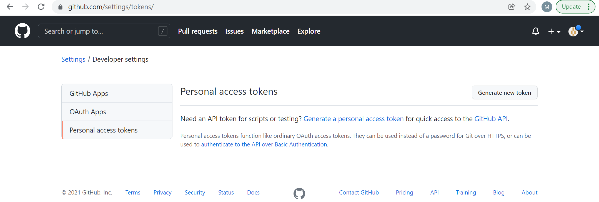

# Create Personal Access Token (PAT)
As an alternative to SSH, repositories can also be cloned / data can be pushed to repositories using HTTP in combination with a PAT.

Since 31/08/2021, you cannot clone your/a repository or push to a repository using your GitHub password in combination with HTTP, but you need to use a so-called Personal Access Token, referred to as PAT. Therefore, once you have created your GitHub account you will need to create a PAT, which will function as your password when logging in from the command line interface (CLI).

You can create a PAT for GitHub in your [account settings](https://github.com/settings/tokens/).

Accessing the link should lead to the following prompt, if you are setting up your PAT for the first time. The screen looks slightly different, if you already created a PAT before and are renewing your PAT.

Click on generate new token, and add the following details on the subsequent page:

--> screenshot

Click on generate token on the bottom of the page.

--> screenshot

Copy your token from your screen, and keep it somewhere safe, as you will need your token to login to GitHub from the CLI. It is important to copy/safe the PAT immediately, as it cannot be seen/accessed on GitHub anymore, once the above window is closed.

A good solution to keep the PAT safe and not have to re-enter it with every clone, push, or pull process is to use a credential/password manager. There are several options to approach this.

# Options to keep PAT safe using a password manager
There are different password managers to use depending on your machine (Linux / Windows / Mac).

## Windows
For Windows machines (also when Git is used via the Linux subsystem), the best option is to use the built-in Credential Manager.

### Option 1: Windows Credential Manager

Open the **Credential Manager**, then click on **Windows Credentials** and **Add a generic credential**.
Alternatively, use the following path: Control Panel\All Control Panel Items\Credential Manager\Add a Generic Credential
You should see the below screen on your machine and enter the network address as below, your GitHub username as username, and your PAT as your password.

Note: This should then work for most machines, when accessing Git through the CLI (Linux subsystem), as then credentials are automatically retrieved and don't need to be entered manually at every clone, push, or pull operation.

### Option 2: Git Credential Manager (with GitBash / Git for Windows)

Another option for Windows, is to use the Git Credential Manager for Windows (GCM). The GCM can be automatically installed when installing GitBash (Git for Windows).
When installing Git for Windows, the credential manager can be automatically installed during installation.

As a next step, you clone a repository or push to a repository and if it's the first attempt you will be prompted to the below window. You choose to login via "Token", and enter the PAT generated in the above steps.

The GCM via BitGash automatically stores the PAT, therefore the process only needs to be performed once. In future cloning, pushing, or pulling the PAT will be automatically retrieved using the GCM.

Here you can find additional [Instructions for GCM](https://github.com/GitCredentialManager/git-credential-manager) from the official GitHub Repository.

### Option 3: Git Credential Manager (without GitBash / Git for Windows)

If you want to use the GCM via a Linux Subsystem, the steps are different from Option 2, as the GCM is not automatically installed.

